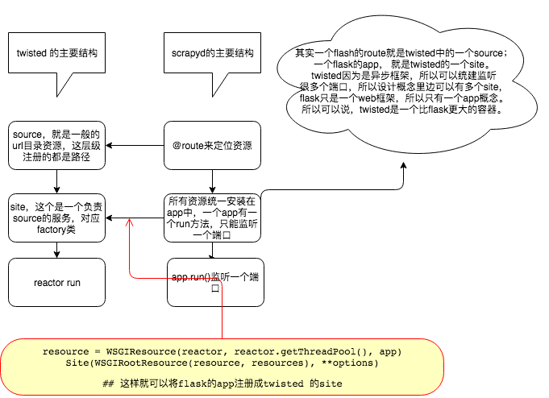

#### 简述

因为开发某个交易平台的爬虫，需要在有交易更新之后爬取交易数据，之前的爬虫执行逻辑效果并不好，并且后来希望添加上监控功能、控制功能，同时增强可视化功能。考虑到这么多功能需要实现，干脆讲这些功能集成在一个后台里，直接做成爬虫后台算了。

_初步计划是基于scrapyd模板，通过jinja2来增强它的可视化，通过添加新的模块来增强它的控制能力_

涉及内容主要是：

*  python安装包的基本概念
* jinja2模板的使用，配合twisted的使用
* scrapyd中twisted和flask的对应关系
* twisted的定时功能

#### Python 安装包

在我们编写第三方包的时候，一般都会编写 `setup.py` 文件，最终我们安装我们编写的包的时候，一般都是 `python setup.py install` 

一般 `setup.py` 文件的格式是：

``` python
import sys

try:
    from setuptools import setup
    using_setuptools = True
except ImportError:
    from distutils.core import setup
    using_setuptools = False

from os.path import join, dirname

with open(join(dirname(__file__), 'scrapycontrol/VERSION')) as f:
    version = f.read().strip()  # 读取version文件

setup_args = {
    'name': 'scrapycontrol',  # 包的名称
    'version': version,
    'url': 'http://www.liangsqrt.com',  # 这个包的官方网站
    'description': 'mmonior scrapy project',  # 对这个包的简单描述
    'long_description': open('README.rst').read(),  # 详细的描述
    'author': 'liang',  # 作者
    'maintainer': 'liang',  # 维护者
    'maintainer_email': 'no!',  # 维护者的email
    'license': 'BSD',  # 遵守的开源协议  常见的MIT， BSD
    'packages': ['scrapycontrol'],  # 需要打包的包的名称(目录)
    'include_package_data': True,  # 是否需要安装非python package东西，比如static静态文件，
    'zip_safe': False,  #  有时候python会将东西压缩在一个zip包里边来管理，避免包被污染。一般不用这个选项，因为有些python不支持zip格式。
    'classifiers': [
        'Programming Language :: Python',
        'Programming Language :: Python :: 2.7',
        'Programming Language :: Python :: 3',
        'Programming Language :: Python :: 3.4',
        'Programming Language :: Python :: 3.5',
        'Programming Language :: Python :: 3.6',
        'License :: OSI Approved :: BSD License',
        'Operating System :: OS Independent',
        'Development Status :: 5 - Production/Stable',
        'Environment :: Console',
        'Environment :: No Input/Output (Daemon)',
        'Topic :: Internet :: WWW/HTTP',
    ],
}


if using_setuptools:  # 这里依赖的包的版本
    setup_args['install_requires'] = [
        'Twisted>=8.0',
        'Scrapy>=1.0',
        'six',
        'enum-compat',
        'jinja2 >= 2.9'
    ]
    setup_args['entry_points'] = {'console_scripts': [
        'scrapycontrol = scrapycontrol.scripts.scrapyd_run:main'
    ]}  # 其他比如在系统只输入scrapycontrol 代表着什么。就是这里的run。
else:
    setup_args['scripts'] = ['scrapycontrol/scripts/scrapyd_run.py']

setup(**setup_args)

```

###### Todo:

* 将执行指令写入到系统的环境变量中是如何做到的
* 为什么安装了之后没有scrapycontrol文件夹


#### jinja2模板的时候

jinja2模板的使用方法和Django的模板十分像，这里总结我用到的几个方法：

``` html

<head>
    <meta charset="UTF-8">
    <link rel="stylesheet" type="text/css" href="{{ '/source/static/Semantic/semantic.min.css' }}">
<script
  src="source/static/jquery-3.1.1.min.js"
  integrity="sha256-hVVnYaiADRTO2PzUGmuLJr8BLUSjGIZsDYGmIJLv2b8="
  crossorigin="anonymous"></script>
<script src="{{ '/source/static/Semantic/semantic.min.js' }}"></script>

    <title>Crontol board</title>
</head>

```

这是表示一个block段，当一个html文件中有这个一个块之后，就可以在其它的html中直接调用这个block就可以，而不需要重新写，这样写的好处就是减少了代码的编写量。

for example

```html
<!DOCTYPE html>
<html lang="en">

<body>

<div class="ui vertical inverted segment">
    <div class="ui inverted menu">
    <a class="ui item"> status </a>
    <a class="ui item" href="/jobs"> jobs </a>
    <a class="ui item" href="/logs"> log </a>
    <a class="ui item"> control board </a>
    <a class="ui item"> configure </a>
</div>
</div>

</body>
</html>
```

就这样子，就直接将header和footer的内容引入了过来。

twisted添加静态文件的方法：

```python
        source_base = os.path.join(source_base, "source")
        self.putChild(b"source", static.File(source_base))
```

其实原理也比较好理解，每次当url中的路径的第一层是source的时候，自动去static.File中指定的路径中寻找。本质上静态文件的位置，就是一个http目录。所以直接存放在twisted的一个child中，也是完全合理的。

Tips:

1. 在twisted中，如果使用jinja2模板，模板里边包含了静态文件，如果直接像上边代码这样引用，是会报找不到文件这种错误的。 原因是twisted并不知道你的静态文件在什么位置，`/source/static/Semantic/semantic.min.js'` 所以这样代码，jinja2模板也找不到source所在的目录。这些设置一般都在web框架中设置好，jinja2 一般无法负责外部空间。


#### flask和twisted的关系

twisted是一个网络包，可以用来写爬虫，也可以用来做服务器，twisted搭建http服务的样子，跟另一个有名的包是一致的：tornada。 他们都是一款异步的框架，都可以支撑很高的并发。其中twisted甚至性能更加强悍一些。

他们都可以搭建网站。twisted搭建网站的逻辑是在reactor负责总的网络管理。reactor中管理者site，一个site就是一个factory，就是可以直接监听一个端口，也可以被reactor监控的一个东西。在site中又有source，source就负责一个端口下的路径。所以twisted可以监听多个端口。而flask则不一样， flask只能监听一个端口，它的app概念对应的管理层级和twisted中site是一样的。而source就直接通过route的装饰器来定义完成了。

``` python
resource = WSGIResource(reactor, reactor.getThreadPool(), self.app)
return Site(WSGIRootResource(resource, self.resources), **options)
```



